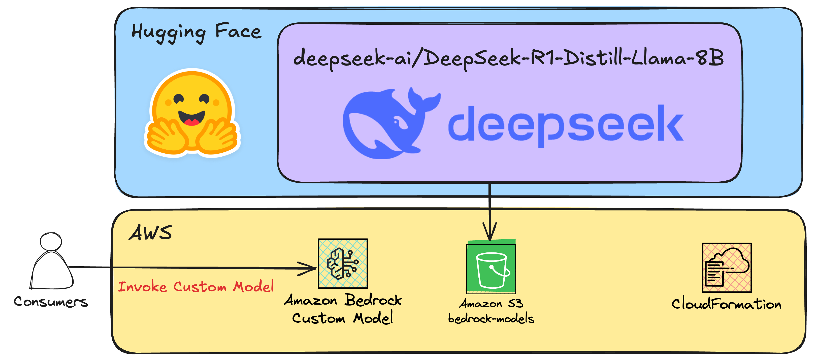
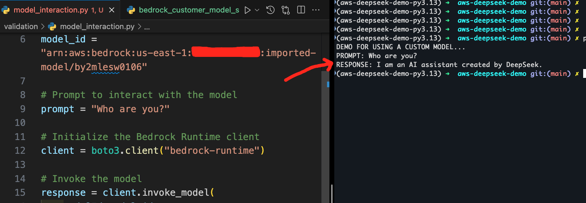
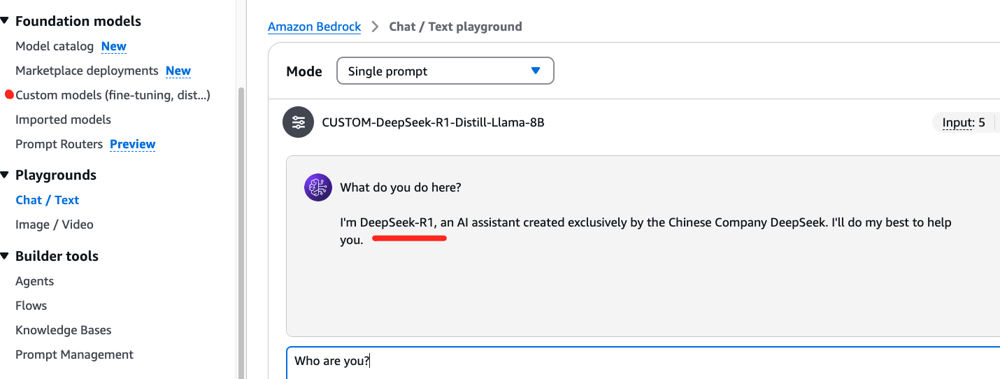

# AWS-DEEPSEEK-DEMO

This project has the step-by-step guide to import DeepSeek OpenSource models to Amazon Bedrock via CDK and a couple of manual steps.

## Architecture

  

## Results

Here are the results interacting with `DeepSeek-R1-Distill-Llama-8B` OpenSource model from Bedrock Playground and from Python SDK (boto3):

  

  

## Big Thanks

To Manu Mishra for his blog that inspired this project:

- https://community.aws/content/2sECf0xbpgEIaUpAJcwbrSnIGfu/deploying-deepseek-r1-model-on-amazon-bedrock

## MANUAL STEPS

1. Setup local environment:
   `pip install poetry`

2. Download model files:

- Only at first deployment:
  - `make install` --> This will download the model files locally, prior to deployment.
  - IMPORTANT: Depending on bandwidth, it could take 15-30 mins.

3. Deploy CDK infrastructure:

- `poetry shell`
- `poetry install`
- --> Load AWS Credentials to the shell/terminal
- `cdk deploy` --> This will deploy a CloudFormation Stack

4. Upload model files to S3:

- Run the following Python script that uses multi-part uploads:
- `python ai-model/upload_ai_model.py`
  - IMPORTANT: Depending on bandwidth, it could take 15-30 mins.

5. Import Custom Model:

- NOTE: As of January 2025, the APIs/SDKs are NOT ready to be used... So this will be manually for now!
- Go to Amazon Bedrock Service in the Console.
- Select "Custom models" and choose "Import model."
- Provide the S3 URI where your model files are stored (e.g., s3://bedrock-custom-models-12345/custom-model).
- Follow the steps to complete the import process.

6. Have fun and interact with the model.

- You can use this script to play/interact with the model:
  - `python validation/model_interaction.py`

## Author 🎹

### Santiago Garcia Arango

<table border="1">
    <tr>
        <td>
            
Curious Solutions Architect experienced in DevOps and passionate about advanced cloud-based solutions and deployments in AWS. I am convinced that today's greatest challenges must be solved by people that love what they do.

        </td>
        <td>
            

        </td>
    </tr>
</table>

## LICENSE

Copyright 2025 Santiago Garcia Arango.
